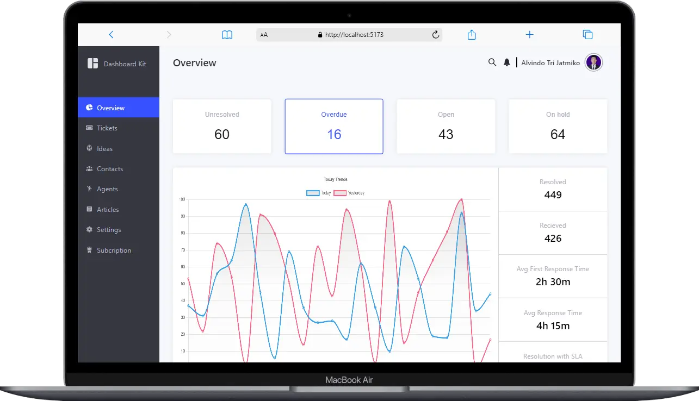
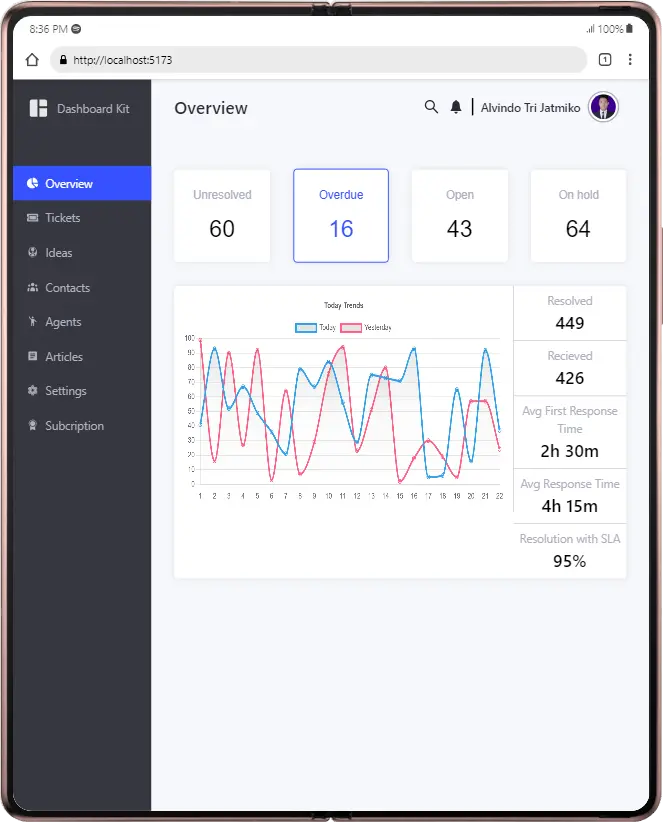
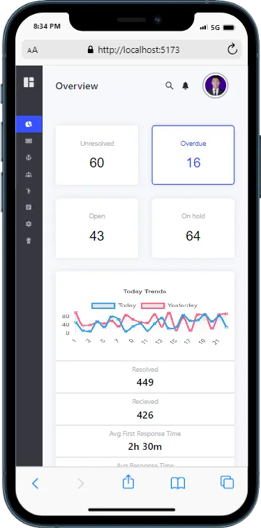

# Admin panel using react and vite

# install

go to the directory folder and run `pnpm install`
when its done now run `pnpm run dev`

# admin email and password

email: admin@mail.com
password: adminadmin

# Screenshot

# Demo

[Demo Link](https://garongan.github.io/admin-panel)
